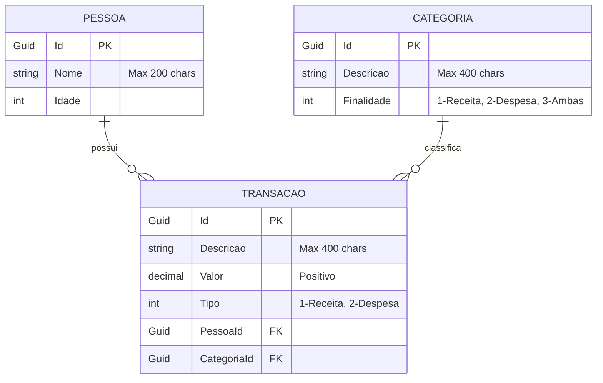

# Controle de Gastos Residencial

## Stack utilizada

### Front-end:
- React v19.2 (LTS) via Vite v8.0.0
- TypeScript & Node v20.20.0
- TanStack Query (Gerenciamento de estado assíncrono e cache)
- React Router (Routing)
- React Hook Form + Zod (Validação de Formulários)
- Tailwind CSS + shadcn/ui (Estilização e Componentes)
- Axios (Cliente HTTP)

### Back-end:
- C# e .NET 10 (ASP.NET Core Web API)
- Entity Framework Core (ORM)
- Swagger / OpenAPI (Documentação)
- Arquitetura: Clean Architecture / DDD

### Banco de Dados:
- PostgreSQL 18.3 (Rodando em Docker)

## Diagrama de Banco de Dados


## Pré-requisitos

### Certifique-se de ter as seguintes ferramentas instaladas:

- Git
- .NET 10 SDK
- Node.js v20.20.0+
- Docker

## Subindo o PostgreSQL com Docker

Entre na pasta da API:

```bash
cd cgr-api
```

Suba o container do PostgreSQL:

```bash
docker compose up -d
```

(Opcional) Acompanhe os logs do banco:

```bash
docker compose logs -f postgres
```

(Quando precisar recriar o volume do banco local):

```bash
docker compose down -v
docker compose up -d
```

## Comandos de Migrations (Entity Framework Core)

Antes de executar os comandos abaixo, certifique-se de ter a ferramenta do Entity Framework instalada globalmente na sua máquina:

```bash
dotnet tool install --global dotnet-ef
```

Entre no projeto de startup (`CGR.Api`):

```bash
cd cgr-api/CGR.Api
```

Restaure os pacotes:

```bash
dotnet restore
```

**Atenção:** Se você acabou de clonar o repositório, não precisa rodar o comando de `add` abaixo. As migrations já existem no projeto. Pule direto para o passo de **Aplique as migrations no banco**.

Crie uma nova migration (apenas quando você alterar ou criar novas entidades no banco de dados):

```bash
dotnet ef migrations add NomeDaSuaMigration --project ../CGR.Infrastructure --startup-project . --context AppDbContext
```

Aplique as migrations existentes no banco:

```bash
dotnet ef database update --project ../CGR.Infrastructure --startup-project . --context AppDbContext
```

Gere o script SQL da migration:

```bash
dotnet ef migrations script --project ../CGR.Infrastructure --startup-project . --context AppDbContext
```

## Executando o Back-end

Ainda no terminal, entre no projeto de inicialização, aplique as migrations e rode a API:

```
cd CGR.Api
dotnet restore
dotnet ef database update --project ../CGR.Infrastructure --startup-project . --context AppDbContext
dotnet run
```
A API deve estar disponivel em http://localhost:5116

Acesse o swagger em http://localhost:5116/swagger/index.html

## Executando o Front-end

Abra um novo terminal, navegue até a pasta do front, instale as dependências e inicie o servidor Vite:

```
cd cgr-frontend
npm install
npm run dev
```

A aplicação deve estar disponível em http://localhost:5173
