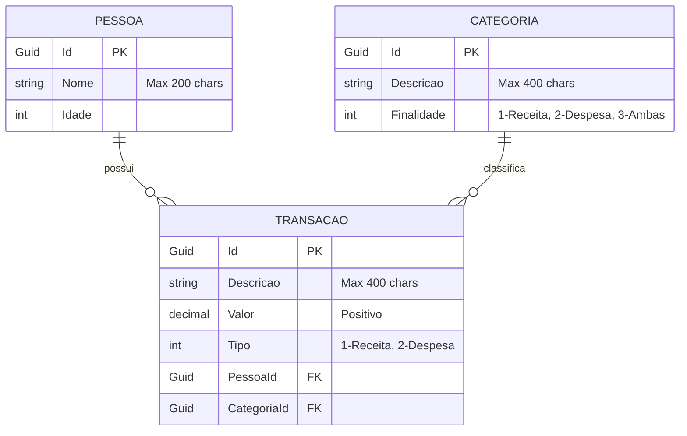

### Diagrama de Banco de Dados



### Subindo o PostgreSQL com Docker

1. Entre na pasta da API:

```bash
cd cgr-api
```

2. Suba o container do PostgreSQL:

```bash
docker compose up -d
```

3. (Opcional) Acompanhe os logs do banco:

```bash
docker compose logs -f postgres
```

4. (Quando precisar recriar o volume do banco local):

```bash
docker compose down -v
docker compose up -d
```

### Comandos de Migrations (Entity Framework Core)

1. Entre no projeto de startup (`CGR.Api`):

```bash
cd cgr-api/CGR.Api
```

2. Restaure os pacotes:

```bash
dotnet restore
```

3. Crie a migration inicial:

```bash
dotnet ef migrations add InitialCreate --project ../CGR.Infrastructure --startup-project . --context AppDbContext
```

4. Aplique as migrations no banco:

```bash
dotnet ef database update --project ../CGR.Infrastructure --startup-project . --context AppDbContext
```

5. (Opcional) Gere o script SQL da migration:

```bash
dotnet ef migrations script --project ../CGR.Infrastructure --startup-project . --context AppDbContext
```